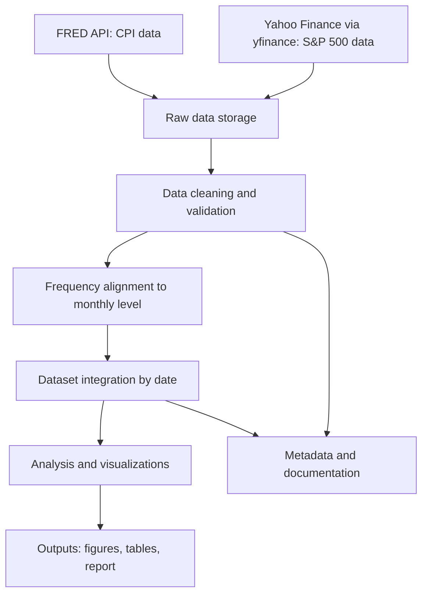

# Workflow Diagram

```mermaid
flowchart TD
    A[FRED API: CPI data] --> B[Raw data storage]
    C[Yahoo Finance via yfinance: S&P 500 data] --> B
    B --> D[Data cleaning and validation]
    D --> E[Frequency alignment to monthly level]
    E --> F[Dataset integration by date]
    F --> G[Analysis and visualizations]
    G --> H[Outputs: figures, tables, report]
    D --> I[Metadata and documentation]
    F --> I
```
