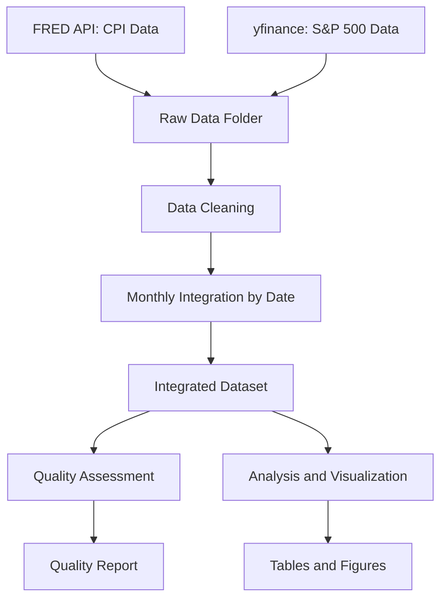

# Workflow Diagram

```mermaid
flowchart TD
    A[FRED API: CPI Data] --> C[Raw Data Folder]
    B[yfinance: S&P 500 Data] --> C
    C --> D[Data Cleaning]
    D --> E[Monthly Integration by Date]
    E --> F[Integrated Dataset]
    F --> G[Quality Assessment]
    F --> H[Analysis and Visualization]
    G --> I[Quality Report]
    H --> J[Tables and Figures]
```
